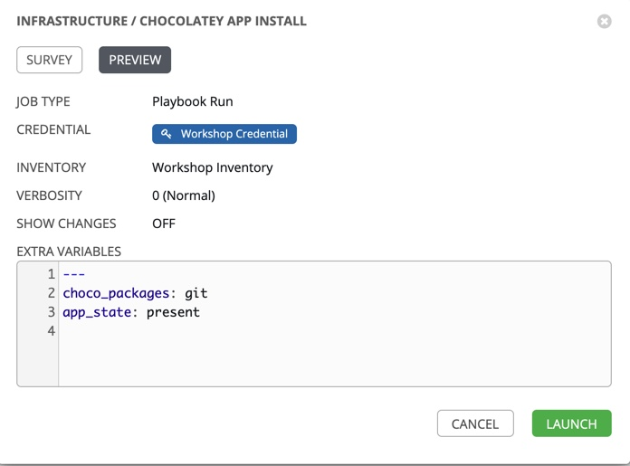
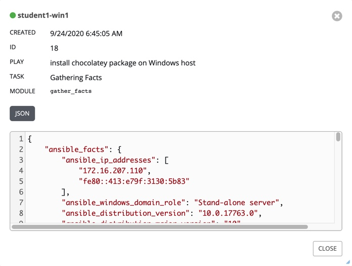

# Demo: Azure Provision VM

[Click here to return to master demo list](../../README.md#demo-repository)

## Table of Contents

* [Objective](#objective)
* [What business problem is solved?](#what-business-problem-is-solved)
* [Features show cased](#features-show-cased)
* [Video](#video)
* [Guide](#guide)

# Objective

Demostrate how anisble along with Chocolatey can install applciation packages to Windows nodes

# What business problem is solved?

- **speed to market**:
reducing human time to install Windows applications
- **reduce human error**:
automation of routine manual processes
- **reduce complexity**:
does not require a System Administrator familiar with the specific operating system to install the Application.  Automate and create a self service option to deploy software.
  

# Features show cased

- Push button deployment
- Self Service IT - Surveys

For description of these and other features of the Red Hat Ansible Automation Platform please refer to the [features README](../features.md)

# Video

Coming Soon

# Guide

1. Login to Ansible Platform UX

2. Navigate to **Templates**

     

3. Click the rocket next to **INFRASTRUCTURE / Chocolatey App Install** to launch the Job

     

4.  The survey will prompt you to install an application.

     

5. Choose an application and press **NEXT**      

     

     Explain to audience what is happening here depending on audience persona

    **Persona A**: Technical audience that has written Ansible Playbooks before:
    Surveys create variables that the Job can use within Ansible Playbooks. This gives you the ability to create one playbook that can be used for multiple installs instead of a job template for each app. In this case due to the multiple Select option you are not limited to 1 app but can select and install 2 or more apps at once. The survey also gives you the ability to select if the app will be installed, removed, or simply updated to the latest version. Again saving you time and effort to write seperate playbooks for each use case.  In the screenshot you will see the variables are named **choco_package** and **app_state**  with values of  **git** and **present** 

    **Persona B**: Decision maker audience, IT manager or above:
    reiterate business values above.  This allows a non subject matter expert the ability to automate routine tasks within a Windows environment.  They can't install applications that are not vetted and put within the survey. Freeing them from the mundance and repeative task for application installation while maintaining the highest level of security and compliance across your organization. In the event that your IT process does not allow the Red Hat Ansible Automation Platform to be the front end, it has a rich and powerful API that can work with existing workflows such as ServiceNow.

6. Execute the job by pressing the green **LAUNCH** button

7. Explain what is happening:

     - Job has started executed in the background.  The user can navigate off this page and the job will continue to execute.
     - On the left is the **Job Details Pane** labeled simply with **DETAILS**.  This information is logged and tells you who, what, when and how.
       - **who** - who launched the job, in this example is the admin user
       - **what** - the project and Ansible Playbook used, and which credential to login to the infrastructure
       - **when** - time stamps for start, end and duration of the job run.
       - **how** - the job status (pass, fail), enviornment and execution node
     - The larger window on the right is the **Standard Out Pane**.  This provides the same console output the user would be used to on the command-line for troubleshooting purposes.  Some important takeways to showcase are:
       - aggregate info is at the top including the amount of Plays, tasks, hosts and time duration.
       - this pane can be expanded to take up entire browser window
       - Ansible Playbook can be downloaded for troubleshooting purposes
       - **click on task output** to show them task-by-task JSON output that can be used for troubleshooting or just getting additional information
       

8. Circle back and summarize

     You need to circle back what has been showcased to the [business reasons listed above](#what-business-problem-is-solved).  You are welcome to verify on the Windows hosts that the application(s) was actually installed but unless you have a very technical audience you are going to start losing folks.  The real business solution here is automating away the mundane and repetative. 

---
You have finished this demo.  [Click here to return to master demo list](../../README.md#demo-repository)
